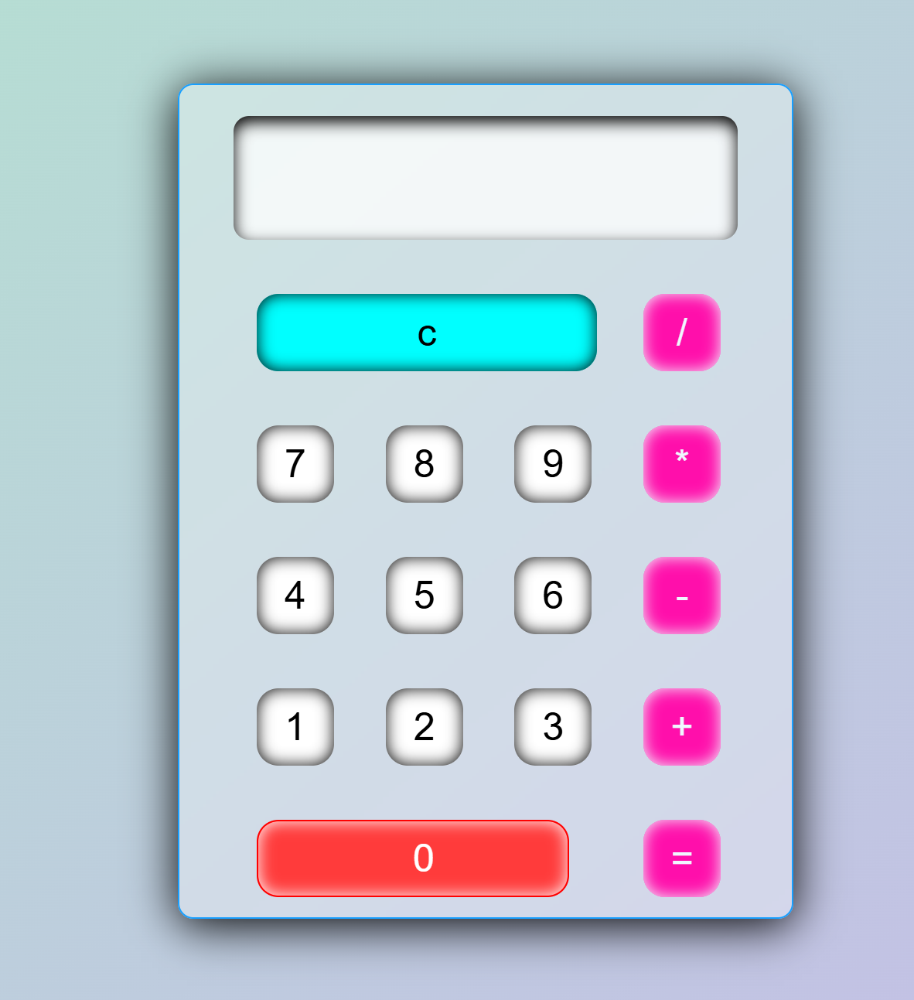

# 🧮 Simple Web Calculator

This is a **beautiful, user-friendly calculator** built using HTML, CSS, and JavaScript.  
It works right in your browser — no installation needed!

---

## 🌟 Features

- ✅ Add, subtract, multiply, and divide
- ✅ Clear button to reset calculations
- ✅ Responsive design — works on mobile too!
- ✅ Styled with a modern glassmorphism look
- ✅ Easy to use — made for everyone!

---

## 🔍 How to Use

1. **Open `index.html`** in any browser (Chrome, Firefox, Edge, etc.)
2. Click on the calculator buttons to enter numbers and operators
3. Press `=` to get the result
4. Use `C` to clear the screen

> ⚠️ Note: This calculator follows simple math logic using JavaScript's built-in `eval()` function. It doesn't support parentheses or advanced math yet.

---

## 🖼️ Preview

  
<!-- Replace this with an actual screenshot or gif if available -->

---

## 📁 Files Overview

| File         | Purpose                        |
|--------------|--------------------------------|
| `index.html` | Structure of the calculator    |
| `style.css`  | Stylish layout and responsiveness |
| `script.js`  | Calculator functionality       |

---

## 💡 Who is it for?

This calculator is perfect for:

- Students doing quick math  
- Anyone who needs a simple calculator in-browser  
- Beginners learning how frontend projects work

---

## 🚀 Want to Try?

You can host it on GitHub Pages or open the `index.html` file directly on your computer!

---

## 🤝 Contribute

Feel free to suggest improvements — like keyboard support, history log, or scientific functions.

---

## 📜 License

This project is open-source and free to use.

---

> Made with ❤️ by [VarunCodeZone]
